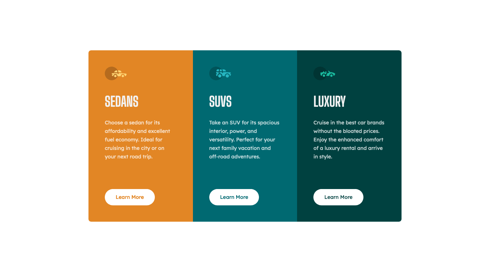

# 3-column preview card component solution

This is a solution to the [3-column preview card component challenge on Frontend Mentor](https://www.frontendmentor.io/challenges/3column-preview-card-component-pH92eAR2-).

## Table of contents

-   [Screenshot](#screenshot)
-   [Links](#links)
-   [Built with](#built-with)
-   [Author](#author)

## Screenshot

## Links

-   [Solution URL](https://github.com/ionStici/column-preview-card-component)
-   [Live Site URL](https://ionstici.github.io/column-preview-card-component)

## Built with

-   Semantic HTML5 markup
-   CSS custom properties
-   CSS Grid and Media Queries

## Author

-   [GitHub](https://github.com/ionStici)
-   [Frontend Mentor](https://www.frontendmentor.io/profile/ionStici)
-   [Twitter](https://twitter.com/ionStici_)

<!--
# Front-end Style Guide

### Primary

Bright orange: hsl(31, 77%, 52%)
Dark cyan: hsl(184, 100%, 22%)
Very dark cyan: hsl(179, 100%, 13%)

### Neutral

Transparent white (paragraphs): hsla(0, 0%, 100%, 0.75)
Very light gray (background, headings, buttons): hsl(0, 0%, 95%)

- Font size: 15px

- Family: [Lexend Deca](https://fonts.google.com/specimen/Lexend+Deca)
- Weights: 400

- Family: [Big Shoulders Display](https://fonts.google.com/specimen/Big+Shoulders+Display)
- Weights: 700
-->
